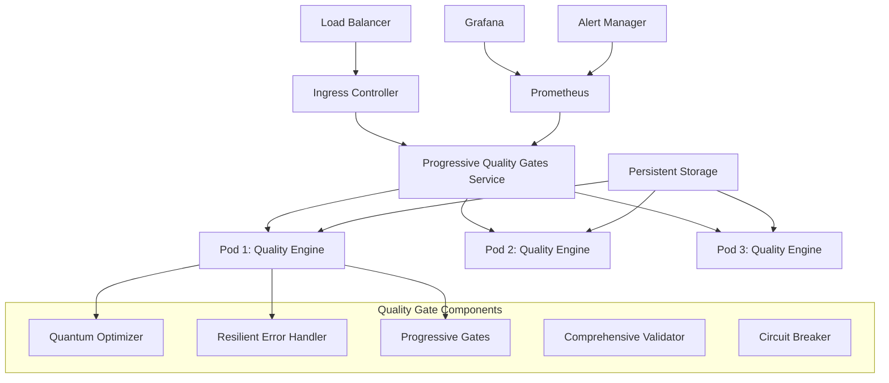

# Progressive Quality Gates - Production Deployment Guide

## Overview

This guide provides comprehensive instructions for deploying the Progressive Quality Gates system to production environments with enterprise-grade security, monitoring, and scalability.

## 🚀 Quick Start

### Prerequisites

- Kubernetes cluster (v1.20+)
- Helm 3.0+
- kubectl configured with cluster access
- Container registry access
- Required secrets (OpenAI API key, GitHub token, etc.)

### 1-Minute Deployment

```bash
# Clone the repository
git clone https://github.com/terragon/progressive-quality-gates
cd progressive-quality-gates

# Build and push Docker image
docker build -f Dockerfile.progressive-quality-gates -t your-registry/progressive-quality-gates:v1.0.0 .
docker push your-registry/progressive-quality-gates:v1.0.0

# Deploy with Helm
helm install progressive-quality-gates deployment/helm/progressive-quality-gates/ \
  --namespace terragon-sdlc \
  --create-namespace \
  --set image.repository=your-registry/progressive-quality-gates \
  --set secrets.data.openai-api-key=$(echo -n "your-openai-key" | base64 -w 0)
```

## 🏗️ Architecture Overview



## 🔧 Configuration

### Core Configuration

The system uses a hierarchical configuration approach:

1. **Default Configuration** (built into container)
2. **ConfigMap Configuration** (Kubernetes ConfigMap)
3. **Environment Variables** (runtime overrides)
4. **Secrets** (sensitive data)

### Quality Gate Thresholds

```yaml
quality_gates:
  thresholds:
    minimum_score: 0.75        # Minimum passing score
    confidence_threshold: 0.8  # Required confidence level
    technical_debt_limit: 0.3  # Maximum technical debt
```

### Optimization Settings

```yaml
optimization:
  quantum_enabled: true           # Enable quantum optimization
  evolutionary_enabled: true     # Enable genetic algorithms
  swarm_intelligence_enabled: true # Enable swarm optimization
  predictive_scaling: true       # Enable predictive scaling
```

### Resilience Configuration

```yaml
resilience:
  circuit_breaker_enabled: true  # Enable circuit breakers
  recovery_strategies:           # Available recovery strategies
    - retry
    - fallback
    - graceful_degrade
    - circuit_break
  max_retries: 3                 # Maximum retry attempts
  timeout_seconds: 30            # Operation timeout
```

## 🚦 Deployment Options

### Option 1: Helm Deployment (Recommended)

```bash
# Add Terragon Helm repository
helm repo add terragon https://charts.terragon.ai
helm repo update

# Install with custom values
helm install progressive-quality-gates terragon/progressive-quality-gates \
  --namespace terragon-sdlc \
  --create-namespace \
  --values production-values.yaml

# Verify deployment
kubectl get pods -n terragon-sdlc
```

### Option 2: Direct Kubernetes Deployment

```bash
# Apply all resources
kubectl apply -f deployment/progressive-quality-gates.yml

# Check deployment status
kubectl rollout status deployment/progressive-quality-gates -n terragon-sdlc
```

### Option 3: GitOps with ArgoCD

```yaml
# argocd-application.yaml
apiVersion: argoproj.io/v1alpha1
kind: Application
metadata:
  name: progressive-quality-gates
  namespace: argocd
spec:
  project: default
  source:
    repoURL: https://github.com/terragon/progressive-quality-gates
    path: deployment/helm/progressive-quality-gates
    targetRevision: HEAD
  destination:
    server: https://kubernetes.default.svc
    namespace: terragon-sdlc
  syncPolicy:
    automated:
      prune: true
      selfHeal: true
```

## 🔐 Security Configuration

### 1. Network Security

```yaml
# Network policy to restrict traffic
apiVersion: networking.k8s.io/v1
kind: NetworkPolicy
metadata:
  name: progressive-quality-gates-netpol
spec:
  podSelector:
    matchLabels:
      app: progressive-quality-gates
  policyTypes:
  - Ingress
  - Egress
  ingress:
  - from:
    - namespaceSelector:
        matchLabels:
          name: ingress-nginx
    ports:
    - protocol: TCP
      port: 8080
  egress:
  - to: []
    ports:
    - protocol: TCP
      port: 443  # HTTPS outbound
```

### 2. Secret Management

```bash
# Create secrets using kubectl
kubectl create secret generic progressive-quality-gates-secrets \
  --from-literal=openai-api-key="your-openai-api-key" \
  --from-literal=github-token="your-github-token" \
  --from-literal=slack-webhook="your-slack-webhook" \
  --namespace terragon-sdlc

# Or use external secret management (e.g., Vault, AWS Secrets Manager)
```

### 3. Pod Security Standards

```yaml
apiVersion: v1
kind: Pod
spec:
  securityContext:
    runAsNonRoot: true
    runAsUser: 1001
    fsGroup: 1001
    seccompProfile:
      type: RuntimeDefault
  containers:
  - name: quality-gates
    securityContext:
      allowPrivilegeEscalation: false
      capabilities:
        drop:
        - ALL
      readOnlyRootFilesystem: false  # Required for logs and cache
```

## 📊 Monitoring and Observability

### Metrics

The system exposes comprehensive metrics at `/metrics`:

- **Quality Metrics**: Scores, trends, confidence levels
- **Performance Metrics**: Execution times, resource usage
- **Error Metrics**: Error rates, recovery success rates
- **System Metrics**: CPU, memory, disk usage

### Prometheus Configuration

```yaml
# prometheus-scrape-config.yaml
scrape_configs:
- job_name: 'progressive-quality-gates'
  kubernetes_sd_configs:
  - role: pod
    namespaces:
      names:
      - terragon-sdlc
  relabel_configs:
  - source_labels: [__meta_kubernetes_pod_annotation_prometheus_io_scrape]
    action: keep
    regex: true
  - source_labels: [__meta_kubernetes_pod_annotation_prometheus_io_port]
    action: replace
    target_label: __address__
    regex: ([^:]+)(?::\d+)?;(\d+)
    replacement: $1:$2
```

### Grafana Dashboard

Import the provided Grafana dashboard (`deployment/monitoring/grafana-dashboard.json`) for comprehensive visualization.

### Alerting Rules

```yaml
groups:
- name: progressive-quality-gates
  rules:
  - alert: QualityScoreBelowThreshold
    expr: quality_gate_overall_score < 0.75
    for: 5m
    labels:
      severity: warning
    annotations:
      summary: "Quality score below threshold"
      description: "Overall quality score is {{ $value }}, below threshold of 0.75"

  - alert: HighTechnicalDebt
    expr: quality_gate_technical_debt > 0.3
    for: 10m
    labels:
      severity: warning
    annotations:
      summary: "High technical debt detected"
      description: "Technical debt is {{ $value }}, above threshold of 0.3"
```

## 🔄 Scaling Configuration

### Horizontal Pod Autoscaling

```yaml
apiVersion: autoscaling/v2
kind: HorizontalPodAutoscaler
metadata:
  name: progressive-quality-gates-hpa
spec:
  scaleTargetRef:
    apiVersion: apps/v1
    kind: Deployment
    name: progressive-quality-gates
  minReplicas: 3
  maxReplicas: 10
  metrics:
  - type: Resource
    resource:
      name: cpu
      target:
        type: Utilization
        averageUtilization: 70
  - type: Resource
    resource:
      name: memory
      target:
        type: Utilization
        averageUtilization: 80
  # Custom metrics for quality gates
  - type: Object
    object:
      metric:
        name: quality_gate_processing_queue_length
      target:
        type: AverageValue
        averageValue: "5"
```

### Vertical Pod Autoscaling

```yaml
apiVersion: autoscaling.k8s.io/v1
kind: VerticalPodAutoscaler
metadata:
  name: progressive-quality-gates-vpa
spec:
  targetRef:
    apiVersion: apps/v1
    kind: Deployment
    name: progressive-quality-gates
  updatePolicy:
    updateMode: "Auto"
  resourcePolicy:
    containerPolicies:
    - containerName: quality-gates
      maxAllowed:
        cpu: 1000m
        memory: 2Gi
      minAllowed:
        cpu: 100m
        memory: 256Mi
```

### Cluster Autoscaling

```yaml
# Node pool for compute-intensive workloads
apiVersion: v1
kind: Node
metadata:
  labels:
    workload-type: compute-intensive
    node.kubernetes.io/instance-type: c5.xlarge
```

## 🌍 Multi-Environment Deployment

### Development Environment

```bash
helm install progressive-quality-gates-dev deployment/helm/progressive-quality-gates/ \
  --namespace terragon-sdlc-dev \
  --create-namespace \
  --values deployment/environments/dev-values.yaml
```

### Staging Environment

```bash
helm install progressive-quality-gates-staging deployment/helm/progressive-quality-gates/ \
  --namespace terragon-sdlc-staging \
  --create-namespace \
  --values deployment/environments/staging-values.yaml
```

### Production Environment

```bash
helm install progressive-quality-gates-prod deployment/helm/progressive-quality-gates/ \
  --namespace terragon-sdlc-prod \
  --create-namespace \
  --values deployment/environments/prod-values.yaml
```

## 🛠️ Maintenance Operations

### Rolling Updates

```bash
# Update to new version
helm upgrade progressive-quality-gates terragon/progressive-quality-gates \
  --set image.tag=v1.1.0 \
  --namespace terragon-sdlc

# Monitor rollout
kubectl rollout status deployment/progressive-quality-gates -n terragon-sdlc
```

### Backup and Recovery

```bash
# Backup configuration
kubectl get configmap progressive-quality-gates-config -o yaml > backup-config.yaml
kubectl get secret progressive-quality-gates-secrets -o yaml > backup-secrets.yaml

# Backup persistent data
kubectl exec -it progressive-quality-gates-pod-xxx -- tar czf - /app/data | \
  kubectl cp progressive-quality-gates-pod-xxx:- ./backup-data.tar.gz
```

### Health Checks

```bash
# Check pod health
kubectl get pods -n terragon-sdlc -l app=progressive-quality-gates

# Check service endpoints
kubectl get endpoints -n terragon-sdlc progressive-quality-gates-service

# Test health endpoint
kubectl port-forward svc/progressive-quality-gates-service 8080:80 -n terragon-sdlc
curl http://localhost:8080/health
```

## 🐛 Troubleshooting

### Common Issues

#### 1. Pod Startup Issues

```bash
# Check pod events
kubectl describe pod progressive-quality-gates-xxx -n terragon-sdlc

# Check logs
kubectl logs progressive-quality-gates-xxx -n terragon-sdlc --previous

# Check resource constraints
kubectl top pods -n terragon-sdlc
```

#### 2. Configuration Issues

```bash
# Validate ConfigMap
kubectl get configmap progressive-quality-gates-config -o yaml -n terragon-sdlc

# Check environment variables
kubectl exec -it progressive-quality-gates-xxx -n terragon-sdlc -- env | grep QUALITY
```

#### 3. Network Issues

```bash
# Test service connectivity
kubectl run -it --rm debug --image=busybox --restart=Never -- \
  wget -qO- http://progressive-quality-gates-service.terragon-sdlc.svc.cluster.local/health

# Check ingress
kubectl get ingress -n terragon-sdlc
```

### Debug Mode

Enable debug mode for detailed logging:

```bash
helm upgrade progressive-quality-gates terragon/progressive-quality-gates \
  --set env.LOG_LEVEL=DEBUG \
  --namespace terragon-sdlc
```

## 🎯 Performance Tuning

### Resource Optimization

```yaml
# For CPU-intensive workloads
resources:
  requests:
    cpu: 200m
    memory: 512Mi
  limits:
    cpu: 1000m
    memory: 2Gi

# For memory-intensive workloads
resources:
  requests:
    cpu: 100m
    memory: 1Gi
  limits:
    cpu: 500m
    memory: 4Gi
```

### Quality Gate Optimization

```yaml
config:
  quality_gates:
    optimization:
      quantum_enabled: true      # Best for complex projects
      evolutionary_enabled: true # Good for iterative improvement
      batch_processing: true     # Process multiple gates in parallel
      cache_duration: 3600      # Cache results for 1 hour
```

## 📋 Compliance and Governance

### GDPR Compliance

- Personal data encryption at rest and in transit
- Data retention policies configured
- Right to deletion implemented
- Privacy by design principles followed

### SOC 2 Compliance

- Comprehensive audit logging
- Access controls implemented
- Security monitoring enabled
- Incident response procedures documented

### SLSA Compliance

- Build provenance tracking
- Software supply chain security
- Vulnerability scanning integrated
- Signed container images

## 🚀 CI/CD Integration

### GitHub Actions

```yaml
name: Deploy Progressive Quality Gates
on:
  push:
    tags:
      - 'v*'

jobs:
  deploy:
    runs-on: ubuntu-latest
    steps:
    - uses: actions/checkout@v3
    
    - name: Deploy to Kubernetes
      run: |
        helm upgrade --install progressive-quality-gates \
          ./deployment/helm/progressive-quality-gates \
          --namespace terragon-sdlc \
          --set image.tag=${{ github.ref_name }}
```

### GitLab CI

```yaml
deploy:
  stage: deploy
  script:
    - helm upgrade --install progressive-quality-gates 
        ./deployment/helm/progressive-quality-gates 
        --namespace terragon-sdlc
        --set image.tag=$CI_COMMIT_TAG
  only:
    - tags
```

## 📞 Support and Documentation

- **Documentation**: https://docs.terragon.ai/progressive-quality-gates
- **Support**: support@terragon.ai
- **Community**: https://community.terragon.ai
- **GitHub Issues**: https://github.com/terragon/progressive-quality-gates/issues

## 📄 License

MIT License - see [LICENSE](../LICENSE) file for details.

---

**Ready to deploy Progressive Quality Gates to production? Follow this guide and achieve autonomous quality excellence!** 🚀