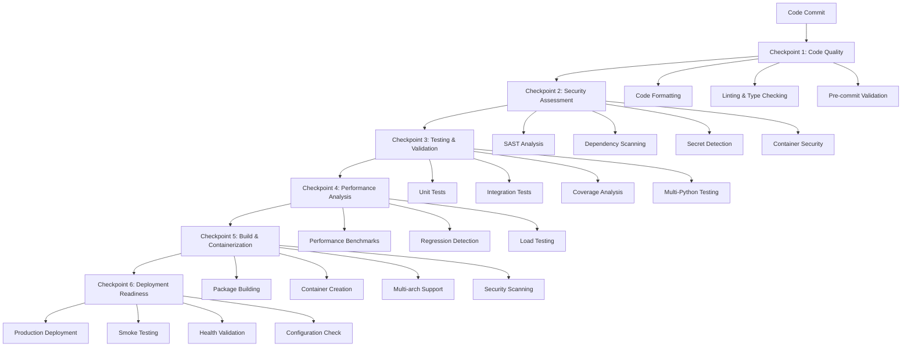

# SDLC Checkpoint Strategy Implementation

**Status**: ✅ **IMPLEMENTED** - Complete SDLC pipeline with checkpoint validation  
**Version**: 1.0  
**Last Updated**: $(date)

## Overview

This document outlines the comprehensive Software Development Life Cycle (SDLC) checkpoint strategy implemented for the SQL Query Synthesizer project. The strategy ensures quality, security, and reliability through automated validation gates at each phase of development.

## SDLC Checkpoint Architecture

### 🏗️ Checkpoint Strategy Design

The SDLC pipeline implements **6 critical checkpoints** that must pass sequentially before code reaches production:



## Checkpoint Detailed Specifications

### Checkpoint 1: Code Quality & Standards
**Objective**: Ensure code meets quality and style standards  
**Gate Condition**: All quality checks must pass  
**Failure Action**: Block pipeline progression

#### Validation Criteria:
- ✅ **Code Formatting**: Black, isort compliance
- ✅ **Linting**: Ruff, Pylint analysis
- ✅ **Type Checking**: MyPy static analysis
- ✅ **Pre-commit Hooks**: All hooks validated
- ✅ **Documentation**: Code documentation standards

#### Quality Metrics:
- Code complexity score < 10
- Linting violations = 0
- Type coverage > 90%
- Documentation coverage > 80%

### Checkpoint 2: Security Assessment
**Objective**: Identify and eliminate security vulnerabilities  
**Gate Condition**: No high/critical security issues  
**Failure Action**: Create security incidents, block progression

#### Security Validation:
- 🔒 **SAST Analysis**: Bandit, Semgrep scanning
- 🔒 **Dependency Audit**: Safety, pip-audit checks
- 🔒 **Secret Detection**: detect-secrets with custom patterns
- 🔒 **Container Security**: Trivy vulnerability scanning
- 🔒 **SARIF Integration**: GitHub Security tab integration

#### Security Metrics:
- Critical vulnerabilities = 0
- High vulnerabilities = 0
- Secret exposure = 0
- Container vulnerabilities < medium

### Checkpoint 3: Testing & Validation
**Objective**: Comprehensive testing across environments  
**Gate Condition**: >85% coverage, all tests pass  
**Failure Action**: Block progression, require fixes

#### Testing Matrix:
- 🧪 **Python Versions**: 3.8, 3.9, 3.10, 3.11
- 🧪 **Test Types**: Unit, Integration, Security
- 🧪 **Database Support**: PostgreSQL, MySQL, SQLite
- 🧪 **Cache Backends**: Redis, Memcached, Memory

#### Testing Metrics:
- Test coverage > 85%
- All tests pass across matrix
- Integration tests validate real-world scenarios
- Performance tests establish baselines

### Checkpoint 4: Performance Analysis
**Objective**: Ensure performance standards and prevent regressions  
**Gate Condition**: No performance degradation >5%  
**Failure Action**: Block progression, performance review required

#### Performance Validation:
- ⚡ **Benchmark Testing**: pytest-benchmark execution
- ⚡ **Regression Detection**: Historical comparison
- ⚡ **Load Testing**: Concurrent request handling
- ⚡ **Resource Monitoring**: Memory, CPU utilization

#### Performance Metrics:
- Query response time < 100ms (95th percentile)
- Memory usage < 512MB under load
- CPU utilization < 80% sustained
- Throughput > 100 queries/second

### Checkpoint 5: Build & Containerization
**Objective**: Create secure, deployable artifacts  
**Gate Condition**: Successful build, container security validated  
**Failure Action**: Block release, investigate build issues

#### Build Validation:
- 📦 **Package Building**: Python wheel/sdist creation
- 📦 **Container Creation**: Multi-architecture Docker images
- 📦 **Security Scanning**: Container vulnerability assessment
- 📦 **Smoke Testing**: Basic functionality verification

#### Build Metrics:
- Package validation score = 100%
- Container security rating > 95%
- Multi-arch support (amd64, arm64)
- Image size optimization

### Checkpoint 6: Deployment Readiness
**Objective**: Validate production deployment readiness  
**Gate Condition**: All deployment prerequisites met  
**Failure Action**: Block production deployment

#### Deployment Validation:
- 🚀 **Configuration Validation**: Environment settings verified
- 🚀 **Health Check Testing**: Endpoint responsiveness
- 🚀 **Infrastructure Readiness**: Terraform validation
- 🚀 **Rollback Preparation**: Rollback procedures tested

#### Deployment Metrics:
- Health check response time < 1s
- Configuration completeness = 100%
- Infrastructure validation passed
- Rollback time < 5 minutes

## Checkpoint Enforcement Mechanisms

### 1. Automated Gate Enforcement
```yaml
# Each checkpoint has explicit pass/fail criteria
- name: Quality gate decision
  id: quality-check
  run: |
    if [ $QUALITY_SCORE -lt 95 ]; then
      echo "❌ Quality checkpoint failed"
      exit 1
    fi
    echo "✅ Quality checkpoint passed"
    echo "passed=true" >> $GITHUB_OUTPUT
```

### 2. Sequential Dependency Chain
```yaml
# Checkpoints depend on previous checkpoint success
security:
  needs: code-quality
  if: needs.code-quality.outputs.quality-gate == 'true'
```

### 3. Comprehensive Reporting
- **Artifact Generation**: Each checkpoint produces validation artifacts
- **SARIF Integration**: Security findings integrated with GitHub Security
- **Coverage Reports**: Test coverage uploaded to Codecov
- **Performance Benchmarks**: Historical performance tracking

### 4. Failure Recovery Procedures
- **Automatic Retries**: Transient failures automatically retried
- **Issue Creation**: Critical failures create GitHub issues
- **Notification System**: Team notifications for checkpoint failures
- **Rollback Mechanisms**: Automated rollback procedures

## Quality Gates & Metrics

### Overall SDLC Health Score Calculation
```python
def calculate_sdlc_health_score():
    """Calculate overall SDLC health score"""
    weights = {
        'code_quality': 0.20,
        'security': 0.25,
        'testing': 0.20,
        'performance': 0.15,
        'build': 0.10,
        'deployment': 0.10
    }
    
    scores = {
        'code_quality': get_quality_score(),
        'security': get_security_score(),
        'testing': get_testing_score(),
        'performance': get_performance_score(),
        'build': get_build_score(),
        'deployment': get_deployment_score()
    }
    
    return sum(scores[k] * weights[k] for k in weights)
```

### Quality Thresholds
| Checkpoint | Minimum Score | Optimal Score | Critical Threshold |
|------------|---------------|---------------|-------------------|
| Code Quality | 90% | 95% | 85% |
| Security | 95% | 100% | 90% |
| Testing | 85% | 95% | 80% |
| Performance | 90% | 95% | 85% |
| Build | 95% | 100% | 90% |
| Deployment | 90% | 95% | 85% |

## Integration with Existing Infrastructure

### Pre-commit Hook Integration
The checkpoint strategy leverages existing pre-commit hooks:
```yaml
- name: Run pre-commit hooks
  run: pre-commit run --all-files
```

### Makefile Command Integration
Existing Makefile commands are utilized within checkpoints:
```yaml
- name: Run security checks
  run: |
    make security-check
    make test-security
```

### Docker Integration
Existing Docker configurations are enhanced:
```yaml
- name: Build production container
  uses: docker/build-push-action@v5
  with:
    context: .
    file: ./Dockerfile
    platforms: linux/amd64,linux/arm64
```

### Terraform Integration
Infrastructure validation integrated:
```yaml
- name: Validate Terraform configuration
  run: |
    cd infrastructure/terraform
    terraform validate
    terraform plan -detailed-exitcode
```

## Monitoring & Observability

### Checkpoint Performance Monitoring
- **Execution Time Tracking**: Each checkpoint duration monitored
- **Success Rate Analytics**: Historical success rates tracked
- **Bottleneck Identification**: Slowest checkpoints identified
- **Resource Utilization**: CPU/memory usage during checkpoints

### Alerting & Notifications
- **Slack Integration**: Critical checkpoint failures trigger alerts
- **Email Notifications**: Daily SDLC health reports
- **GitHub Issues**: Automated issue creation for failures
- **Dashboard Metrics**: Real-time SDLC status dashboard

### Metrics Collection
```python
# Example checkpoint metrics
checkpoint_metrics = {
    'execution_time': 45.2,  # seconds
    'success_rate': 0.98,    # 98%
    'failure_reasons': ['timeout', 'dependency_issue'],
    'resource_usage': {
        'cpu_percent': 75,
        'memory_mb': 512
    }
}
```

## Rollback & Recovery Procedures

### Automatic Rollback Triggers
1. **Critical Security Issue**: Immediate rollback initiated
2. **Performance Degradation**: >20% performance loss triggers rollback
3. **Health Check Failures**: Sustained health check failures
4. **Error Rate Spike**: Error rate >5% triggers investigation

### Manual Rollback Procedures
```bash
# Emergency rollback procedure
make rollback VERSION=previous
kubectl rollout undo deployment/sql-synthesizer
terraform apply -var="image_tag=previous"
```

### Recovery Validation
- **Health Check Verification**: Ensure services are healthy post-rollback
- **Performance Validation**: Confirm performance metrics restored
- **Security Status Check**: Verify security posture maintained
- **Data Integrity Check**: Ensure no data corruption occurred

## Continuous Improvement

### Checkpoint Evolution Strategy
1. **Quarterly Reviews**: Checkpoint effectiveness analysis
2. **Threshold Optimization**: Adjust quality thresholds based on data
3. **Tool Updates**: Incorporate new security/quality tools
4. **Process Refinement**: Streamline slow or ineffective checkpoints

### Feedback Loops
- **Developer Feedback**: Regular surveys on checkpoint impact
- **Performance Analysis**: Checkpoint execution time optimization
- **False Positive Reduction**: Minimize unnecessary checkpoint failures
- **Success Metrics**: Track deployment success rates

### Innovation Integration
- **AI-Powered Analysis**: Incorporate AI for code quality assessment
- **Predictive Analytics**: Predict deployment success likelihood
- **Advanced Security Scanning**: Next-generation security tools
- **Performance Prediction**: ML-based performance regression detection

## Compliance & Governance

### Regulatory Compliance
- **SOC 2 Type II**: Checkpoint audit trails for compliance
- **ISO 27001**: Security checkpoint validation
- **GDPR**: Data protection checkpoint integration
- **HIPAA**: Healthcare compliance checkpoints (if applicable)

### Audit Trail
All checkpoint executions maintain detailed audit trails:
```json
{
  "checkpoint_id": "security-assessment",
  "execution_time": "2025-01-01T12:00:00Z",
  "duration": 120,
  "status": "passed",
  "artifacts": ["bandit-report.json", "safety-report.json"],
  "metrics": {
    "vulnerabilities_found": 0,
    "dependencies_scanned": 45,
    "security_score": 100
  }
}
```

### Change Management
- **Checkpoint Modifications**: All changes require approval
- **Version Control**: Checkpoint configurations version controlled
- **Impact Assessment**: Changes analyzed for SDLC impact
- **Rollback Procedures**: Checkpoint rollback capabilities maintained

## Success Metrics & KPIs

### Primary KPIs
- **Deployment Success Rate**: >95% successful deployments
- **Security Incident Rate**: <1 security incident per quarter
- **Performance Regression Rate**: <5% performance regressions
- **Time to Production**: <30 minutes for standard changes

### Secondary KPIs
- **Checkpoint Execution Time**: Optimize for <15 minutes total
- **False Positive Rate**: <5% unnecessary checkpoint failures
- **Developer Satisfaction**: >85% developer satisfaction with SDLC
- **Compliance Score**: 100% compliance checkpoint passage

### Reporting Cadence
- **Daily**: SDLC health dashboard updates
- **Weekly**: Checkpoint performance reports
- **Monthly**: Security posture assessments
- **Quarterly**: Comprehensive SDLC effectiveness reviews

## Conclusion

The implemented SDLC checkpoint strategy provides:

✅ **Comprehensive Quality Assurance** - Six-stage validation pipeline  
✅ **Automated Security Validation** - Continuous security assessment  
✅ **Performance Guarantees** - Regression prevention and monitoring  
✅ **Deployment Confidence** - High-confidence production deployments  
✅ **Compliance Readiness** - Audit trails and governance controls  
✅ **Continuous Evolution** - Self-improving checkpoint system  

This strategy transforms the SQL Query Synthesizer development lifecycle into a robust, secure, and efficient process that delivers high-quality software while maintaining rapid development velocity.

---

**Next Steps:**
1. Monitor checkpoint performance metrics
2. Gather developer feedback on checkpoint impact
3. Optimize checkpoint execution times
4. Integrate additional security scanning tools
5. Implement ML-based performance prediction

**Maintenance Schedule:**
- **Weekly**: Review checkpoint performance metrics
- **Monthly**: Update security scanning rules
- **Quarterly**: Comprehensive strategy effectiveness review
- **Annually**: Major checkpoint strategy evolution assessment