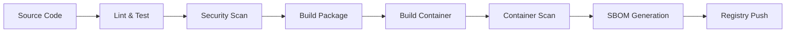

# Build Automation

Automated build processes and CI/CD integration for the SQL Query Synthesizer.

## Build Pipeline Overview



## Automated Build Scripts

### Package Build
```bash
#!/bin/bash
# scripts/build-package.sh

set -euo pipefail

echo "Building Python package..."
python -m build --wheel --sdist

echo "Validating package..."
twine check dist/*

echo "Package build complete!"
```

### Container Build
```bash
#!/bin/bash
# scripts/build-container.sh

set -euo pipefail

VERSION=${1:-latest}
IMAGE_NAME="sql-synthesizer:${VERSION}"

echo "Building container image: ${IMAGE_NAME}"
docker build -t "${IMAGE_NAME}" .

echo "Scanning for vulnerabilities..."
docker run --rm -v /var/run/docker.sock:/var/run/docker.sock \
  aquasec/trivy image "${IMAGE_NAME}"

echo "Generating SBOM..."
python scripts/generate_advanced_sbom.py --format spdx --output "sbom-${VERSION}.json"

echo "Container build complete!"
```

## Semantic Release Configuration

### Release Automation
```json
{
  "branches": ["main"],
  "plugins": [
    "@semantic-release/commit-analyzer",
    "@semantic-release/release-notes-generator",
    "@semantic-release/changelog",
    "@semantic-release/github",
    [
      "@semantic-release/exec",
      {
        "prepareCmd": "scripts/build-release.sh ${nextRelease.version}",
        "publishCmd": "scripts/publish-release.sh ${nextRelease.version}"
      }
    ]
  ]
}
```

### Commit Conventions
```
feat: new feature
fix: bug fix
docs: documentation changes
style: formatting changes
refactor: code refactoring
test: test changes
chore: maintenance tasks
```

## Container Registry Integration

### Multi-Registry Push
```bash
#!/bin/bash
# scripts/push-container.sh

VERSION=${1:-latest}
REGISTRIES=(
  "ghcr.io/yourorg/sql-synthesizer"
  "docker.io/yourorg/sql-synthesizer"
  "your-registry.com/sql-synthesizer"
)

for registry in "${REGISTRIES[@]}"; do
  echo "Pushing to ${registry}:${VERSION}"
  docker tag "sql-synthesizer:${VERSION}" "${registry}:${VERSION}"
  docker push "${registry}:${VERSION}"
done
```

### Container Signing
```bash
# Sign containers with cosign
cosign sign --key cosign.key "${IMAGE_NAME}"

# Verify signatures
cosign verify --key cosign.pub "${IMAGE_NAME}"
```

## Build Optimization

### Docker Build Optimization
```dockerfile
# Use BuildKit for advanced caching
# syntax=docker/dockerfile:1

FROM python:3.11-slim as builder

# Enable BuildKit cache mounts
RUN --mount=type=cache,target=/root/.cache/pip \
    pip install --user -r requirements.txt
```

### Multi-Architecture Builds
```bash
# Build for multiple architectures
docker buildx build --platform linux/amd64,linux/arm64 \
  -t sql-synthesizer:latest --push .
```

## Quality Gates

### Build Prerequisites
```bash
#!/bin/bash
# scripts/quality-gate.sh

echo "Running quality gates..."

# Code quality
make lint || exit 1
make format-check || exit 1

# Testing
make test-coverage || exit 1
[ $(coverage report --format=total) -ge 80 ] || exit 1

# Security
make security || exit 1
bandit -r sql_synthesizer/ -f json | jq '.results | length == 0' || exit 1

echo "All quality gates passed!"
```

### Performance Benchmarks
```bash
#!/bin/bash
# scripts/performance-gate.sh

echo "Running performance benchmarks..."

# Start test environment
docker-compose -f docker-compose.test.yml up -d

# Run benchmarks
pytest tests/performance/ --benchmark-json=benchmark.json

# Validate performance thresholds
python scripts/validate-performance.py benchmark.json

echo "Performance benchmarks completed!"
```

## Build Artifacts

### Artifact Structure
```
dist/
├── sql_synthesizer-0.2.2-py3-none-any.whl
├── sql_synthesizer-0.2.2.tar.gz
├── sbom.json
├── security-report.json
├── test-results.xml
└── coverage.xml
```

### Artifact Signing
```bash
# GPG signing
gpg --detach-sign --armor dist/sql_synthesizer-0.2.2.tar.gz

# SHA256 checksums
sha256sum dist/* > dist/checksums.txt
```

## Environment-Specific Builds

### Development Build
```bash
# Fast development build
docker build --target builder -t sql-synthesizer:dev .
```

### Production Build
```bash
# Optimized production build
docker build --target production \
  --build-arg BUILD_VERSION=$(git describe --tags) \
  -t sql-synthesizer:$(git describe --tags) .
```

### Testing Build
```bash
# Build with test dependencies
docker build --target testing \
  --build-arg INCLUDE_TEST_DEPS=true \
  -t sql-synthesizer:test .
```

## Continuous Integration Integration

### GitHub Actions
```yaml
name: Build and Test
on: [push, pull_request]

jobs:
  build:
    runs-on: ubuntu-latest
    steps:
      - uses: actions/checkout@v3
      - name: Set up Python
        uses: actions/setup-python@v4
        with:
          python-version: '3.11'
      
      - name: Install dependencies
        run: make ci-install
      
      - name: Run quality gates
        run: scripts/quality-gate.sh
      
      - name: Build package
        run: make build
      
      - name: Build container
        run: make docker-build
```

### GitLab CI
```yaml
stages:
  - test
  - build
  - deploy

test:
  stage: test
  script:
    - make ci-install
    - make ci-test
    - make ci-security

build:
  stage: build
  script:
    - make build
    - make docker-build
  artifacts:
    paths:
      - dist/
      - sbom.json
```

## Monitoring Build Health

### Build Metrics
- Build duration trends
- Test coverage evolution
- Security vulnerability counts
- Container image size tracking
- Build success/failure rates

### Alerting
```yaml
# Prometheus alerts for build failures
- alert: BuildFailureRate
  expr: rate(build_failures_total[1h]) > 0.1
  for: 5m
  annotations:
    summary: "High build failure rate detected"
```

For implementation details and troubleshooting, see the specific build scripts in the `scripts/` directory.