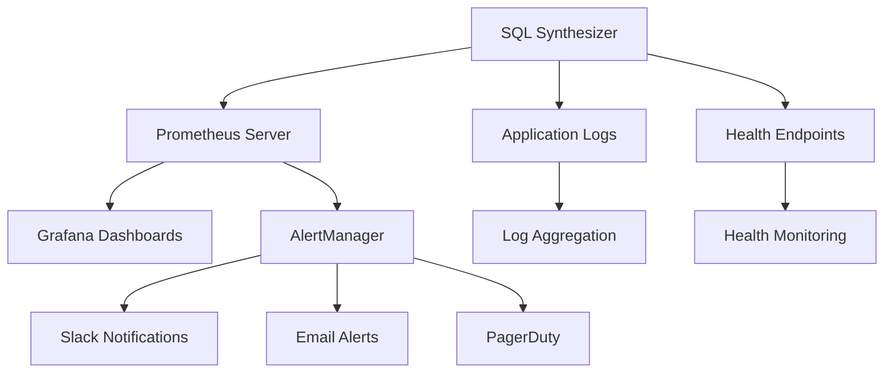

# Monitoring & Observability

Comprehensive monitoring and observability setup for the SQL Query Synthesizer.

## Overview

The SQL Query Synthesizer includes a complete observability stack with:
- **Metrics Collection** - Prometheus for application and system metrics
- **Visualization** - Grafana dashboards for operational insights  
- **Logging** - Structured application logging with security audit trail
- **Health Monitoring** - Application and dependency health checks
- **Alerting** - Automated alerting for critical events

## Architecture



## Quick Start

### Local Development
```bash
# Start monitoring stack
docker-compose up prometheus grafana

# Access dashboards
open http://localhost:3000  # Grafana (admin/admin)
open http://localhost:9090  # Prometheus
```

### Production Setup
```bash
# Deploy with monitoring
docker-compose -f docker-compose.yml -f docker-compose.monitoring.yml up -d

# Configure alerts
cp monitoring/alerts.yml /etc/alertmanager/
```

## Metrics Collection

### Application Metrics
The application exposes metrics at `/metrics` endpoint:

```python
from sql_synthesizer.metrics import query_duration, cache_hit_rate

# Automatic instrumentation
@query_duration.time()
def process_query(query):
    return generate_sql(query)

# Manual metrics
cache_hit_rate.inc()
```

### Available Metrics
- `query_request_duration_seconds` - Query processing time
- `database_connection_pool_size` - Active database connections
- `cache_hit_rate_total` - Cache performance metrics
- `security_events_total` - Security event counts
- `api_requests_total` - API request counts and status codes

### Custom Metrics
```python
from prometheus_client import Counter, Histogram

# Define custom metrics
custom_metric = Counter('custom_operations_total', 'Custom operations')

# Use in application
custom_metric.inc()
```

## Dashboards

### Available Dashboards
1. **Application Overview** - High-level system health
2. **Query Performance** - SQL generation and execution metrics
3. **Database Metrics** - Connection pool and query statistics
4. **Security Dashboard** - Security events and audit trail
5. **Infrastructure** - System resources and container health

### Dashboard Configuration
```yaml
# grafana/provisioning/dashboards/dashboard.yml
apiVersion: 1
providers:
  - name: 'default'
    orgId: 1
    folder: ''
    type: file
    disableDeletion: false
    updateIntervalSeconds: 10
    path: /var/lib/grafana/dashboards
```

### Custom Dashboard Creation
1. Access Grafana at http://localhost:3000
2. Create new dashboard
3. Add panels with PromQL queries
4. Export JSON configuration
5. Save to `monitoring/grafana/dashboards/`

## Alerting

### Alert Configuration
```yaml
# monitoring/alerts.yml
groups:
  - name: sql_synthesizer
    rules:
      - alert: HighErrorRate
        expr: rate(api_requests_total{status="500"}[5m]) > 0.1
        for: 5m
        annotations:
          summary: "High error rate detected"
          
      - alert: DatabaseConnectionFailure
        expr: database_connections_failed_total > 0
        for: 1m
        annotations:
          summary: "Database connection failures"
```

### Notification Channels
```yaml
# monitoring/alertmanager.yml
global:
  slack_api_url: 'YOUR_SLACK_WEBHOOK_URL'

route:
  group_by: ['alertname']
  group_wait: 10s
  group_interval: 10s
  repeat_interval: 1h
  receiver: 'web.hook'

receivers:
  - name: 'web.hook'
    slack_configs:
      - channel: '#alerts'
        title: 'SQL Synthesizer Alert'
        text: '{{ range .Alerts }}{{ .Annotations.summary }}{{ end }}'
```

## Health Monitoring

### Health Check Endpoints
```bash
# Application health
curl http://localhost:5000/health

# Detailed health with dependencies
curl http://localhost:5000/health/detailed

# Metrics endpoint
curl http://localhost:5000/metrics
```

### Health Check Response
```json
{
  "overall_healthy": true,
  "timestamp": "2025-01-15T10:30:00Z",
  "checks": {
    "database": {
      "healthy": true,
      "response_time": 0.05,
      "details": "Connection pool: 5/10 active"
    },
    "cache": {
      "healthy": true,
      "response_time": 0.01,
      "details": "Redis connection OK"
    },
    "openai": {
      "healthy": true,
      "response_time": 0.2,
      "details": "API endpoint accessible"
    }
  }
}
```

## Logging

### Log Levels and Structure
```python
import logging
from sql_synthesizer.logging_utils import get_logger

logger = get_logger(__name__)

# Structured logging
logger.info("Query processed", extra={
    "query_id": "123",
    "duration": 0.5,
    "status": "success"
})
```

### Log Aggregation
```yaml
# docker-compose.logging.yml
version: '3.8'
services:
  fluentd:
    image: fluent/fluentd:latest
    ports:
      - "24224:24224"
    volumes:
      - ./monitoring/fluentd.conf:/fluentd/etc/fluent.conf
```

### Security Audit Logs
```json
{
  "event_type": "query_execution",
  "timestamp": "2025-01-15T10:30:00Z",
  "user_id": "user123",
  "query": "SELECT * FROM users",
  "ip_address": "192.168.1.100",
  "success": true,
  "duration": 0.1
}
```

## Performance Monitoring

### Query Performance
- Query generation latency
- Database execution time
- Cache hit/miss ratios
- Concurrent request handling

### System Performance
- CPU and memory usage
- Disk I/O and network
- Container resource utilization
- Garbage collection metrics

### SLA Monitoring
```yaml
# SLA definitions
slos:
  availability: 99.9%
  response_time_p95: 100ms
  error_rate: <1%
```

## Troubleshooting

### Common Issues
1. **Metrics not appearing** - Check `/metrics` endpoint accessibility
2. **Dashboard not loading** - Verify Grafana data source configuration
3. **Alerts not firing** - Check AlertManager configuration and connectivity

### Debug Commands
```bash
# Check metric exposition
curl http://localhost:5000/metrics | grep query_duration

# Validate Prometheus config
docker exec prometheus promtool check config /etc/prometheus/prometheus.yml

# Test Grafana connectivity
docker exec grafana grafana-cli admin reset-admin-password admin
```

## Production Considerations

### Retention Policies
```yaml
# Prometheus retention
prometheus:
  retention.time: 30d
  retention.size: 50GB

# Log retention
logging:
  retention_days: 90
  max_size: 10GB
```

### Security
- TLS encryption for metric endpoints
- Authentication for Grafana access
- Network isolation for monitoring stack
- Secure credential management

### Scalability
- Prometheus federation for multi-cluster
- Grafana clustering for high availability
- Log shipping to external systems
- Metric sampling for high-volume systems

For detailed implementation guides, see the specific documentation files in this directory.